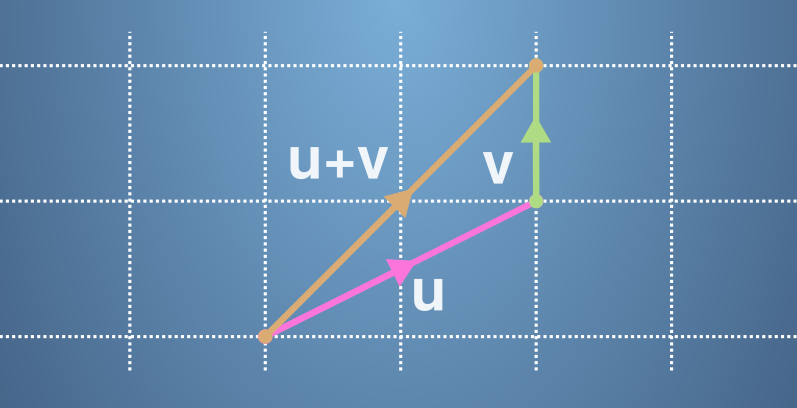

# **Introduction to Linear Algebra and to Mathematics for Machine Learning**

- <details close><summary><h2>Practice Quiz 1 : Exploring parameter space</h2></summary>

    ### <span style="color: green;">**Congratulations! You passed!**</span>

    #### **Grade received** <span style="color: green;">90%</span>

    #### **Latest Submission Grade** 90%

    #### **To pass** 40% or higher

    ---

    1. In this exercise, we shall see how it is often convenient to use vectors in machine learning. These could be in the form of data itself, or model parameters, and so on.

        The purpose of this exercise is to set the scene for Linear Algebra and the rest of the maths we will cover in the specialization. If this is confusing right now - stick with us! We'll build up your skills throughout the rest of the course. For this reason we've set a low pass mark for this quiz, but even if you don't pass in one go, reading the feedback from a wrong answer can often give more insight than guessing a correct answer!
        $$∗∗∗$$
        The problem we shall focus on in this exercise is the distribution of heights in a population.

        If we do a survey of the heights of people in a population, we may get a distribution like this:

        

        This histogram indicates how likely it is for anyone in the survey to be in a particular height range. (6 ft is around 183 cm)

        This histogram can also be represented by a vector, i.e. a list of numbers. In this case, we record the frequency of people with heights in little groups at 2.5 cm intervals, i.e. between 150 cm and 152.5 cm, between 152.5 cm and 155 cm, and so on. We can define this as the vector $f$ with components,

        $$
        f = \begin{bmatrix}
            f_{150.0, 152.5} \\
            f_{152.0, 155.0} \\
            f_{155.0, 157.5} \\
            f_{157.5, 160.0} \\
            f_{160.0, 162.5} \\
            \vdots
        \end{bmatrix}
        $$

        These vector components are then the sizes of each bar in the histogram.

        Of the following statements, select all that you think are true.

       - [x] There are at least 10 elements in the frequency vector, $f$
            > ✔️ <spane style="color: green;">**Correct**</br>The data has been grouped into around 20 bins each having a width of 2.5 cm, in the range between 150 cm and 210 cm. Around 15 of these have a non-zero frequency.</span>
       - [ ] If another sample was taken under the same conditions, the frequencies should be broadly similar.
       - [x] If another sample was taken under the same conditions, the frequencies would be exactly the same.
            > ✖️ <span style="color: red;">**This should not be selected**</br>The data is just a sample of the population. If the sample is large enough it will be representative of the population it is taken from, but there will always be fluctuations around the population distribution.</span>
       - [ ] None of the other statements.
       - [ ] No one in the world is less than 160 cm tall.

    ---

    2. One of the tasks of machine learning is to fit a model to data in order to represent the underlying distribution.

        For the heights of a population, a model we may use to predict frequencies is the Normal (or Gaussian) distribution. This is a model for a bell-shaped curve, which looks like this,

        

        It has the slightly complicated equation,

        $$g(x) = \frac{1}{\sigma \sqrt{2 \pi}}exp(-\frac{(x-\mu)^{2}}{2\sigma^{2}})$$

        the exact form of which is unimportant, except that it is dependent on two parameters, the mean, $\mu$, where the curve is centred, and the standard deviation, $\sigma$, which is the characteristic width of the bell curve (measured from the mean).

        We can put these two parameters in a vector, $p = \begin{bmatrix}
            \mu \\
            \sigma
        \end{bmatrix}$

        Pick the parameter vector $p$ which best describes the distribution pictured.

        - [ ]
        $p=\begin{bmatrix}
            143 \\
            167
        \end{bmatrix}$
        - [ ]
        $p=\begin{bmatrix}
            155 \\
            3
        \end{bmatrix}$
        - [ ]
        $p=\begin{bmatrix}
            167 \\
            24
        \end{bmatrix}$
        - [ ]
        $p=\begin{bmatrix}
            167 \\
            12
        \end{bmatrix}$
        - [x]
        $p=\begin{bmatrix}
            155 \\
            12
        \end{bmatrix}$

        > ✔️ <span style="color: green;">**Correct**</br>The mean is 155 cm and the standard deviation is 12 cm.</span>

    ---

    3. Pick the Normal distribution that corresponds the closest to the parameter vector $p = \begin{bmatrix}
        3 \\
        3
    \end{bmatrix}$

        - [x] 
        - [ ] 
        - [ ] 
        - [ ] 

        > ✔️ <span style="color: green;">**Correct**</br>The distribution has parameters, $p = \begin{bmatrix}
            3 \\
            3
        \end{bmatrix}$.</span>

    ---

    4. A model allows us to predict the data in a distribution. In our example we can start with a parameter vector $p$ and convert it to a vector of expected frequencies $g_p$, for example,

        $$
        g_p = \begin{bmatrix}
            f_{150.0, 152.5} \\
            f_{152.0, 155.0} \\
            f_{155.0, 157.5} \\
            f_{157.5, 160.0} \\
            f_{160.0, 162.5} \\
            \vdots
        \end{bmatrix}
        $$

        A model is only considered good if it fits the measured data well. Some specific values for the parameters will be better than others for a model. We need a way fit a model's parameters to data and quantify how good that fit is.

        One way of doing so is to calculate the "residuals", which is the difference between the measured data and the modelled prediction for each histogram bin.

        This is illustrated below. The model is shown in pink, the measured data is shown in orange and where they overlap is shown in green. The height of the pink and orange bars are the residuals.

        

        A better fit would have as much overlap as it can, reducing the residuals as much as possible.

        How could the model be improved to give the best fit to the data?

        - [x] Keep the standard deviation, $\sigma$, approximately the same.
            > ✔️ <span style="color: green;">**Correct**</br>The model has a width similar to the data</span>
        - [ ] Decrease the mean $\mu$
        - [ ] Increase the standard deviation $\sigma$
        - [ ] Keep the mean $\mu$ approximately the same.
        - [ ] Decrease the standard deviation $\sigma$
        - [x] Increase the mean $\mu$
            > ✔️ <span style="color: green;">**Correct**</br>The mean of the model is too low.</span>

    ---

    5. The performance of a model can be quantified in a single number. One measure we can use is the Sum of Squared Residuals, $SSR$. Here we take all of the residuals (the difference between the measured and predicted data), square them and add them together.

        In the language of vectors we can write this as, $SSR(p) = |f - g_p|^{2}$, which will be explained further on in this course.

        Use the following code block to play with parameters of a model, and try to get the best fit to the data.

        ```python
        # Play with values of μ and σ to find the best fit.
        μ = 178 ; σ = 8
        p = [μ, σ]
        histogram(p)
        ```

        Find a set of parameters with a fit $SSR \leq 0.00051$.

        Input your fitted parameters into the code block below.

        ```python
        # Replace μ and σ with values that minimise the SSR.
        p = [178, 8]
        ```

        > ✔️ <spane style="color: green;">**Correct**</br>Well done! You found a model that fits the data acceptably well according the the criterion defined for SSR.</span>

    ---

    6. Since each parameter vector $p$ represents a different bell curve, each with its own value for the sum of squared residuals, $SSR$, we can draw the surface of $SSR$ values over the space spanned by $p$, such as $\mu$ and $\sigma$ in this example.

        Here is an illustration of this surface for our data.

        

        Every point on this surface represents the SSR of a choice of parameters, with some bell curves performing better at representing the data than others.

        We can take a ‘top-down’ view of the surface, and view it as a contour map, where each of the contours (in green here) represent a constant value for the $SSR$.

        

        The goal in machine learning is to find the parameter set where the model fits the data as well as it possibly can. This translates into finding the lowest point, the global minimum, in this space.

        Select all true statements below.

        - [ ] At the minimum of the surface, the model exactly matches the measured data.
        - [x] Moving at right angles to contour lines in the parameter space will have the greatest effect on the fit than moving in other directions.
            > ✔️ <spane style="color: green;">**Correct**</br>For example, moving along contour lines has no affect on the $SSR$ (by definition). However moving perpendicular to them can significantly improve or reduce the quality of the fit.</span>
        - [ ] None of the other statements.
        - [x] Each point on the surface represents a set of parameters $p = \begin{bmatrix}
            \mu \\
            \sigma
        \end{bmatrix}$
            > ✔️ <spane style="color: green;">**Correct**</br>This means each point in the space will generate a different histogram of expected data, which will perform better or worse against the measured data.</span>
        - [ ] You get the same model by following along a contour line.

    ---

    7. Often we can't see the whole parameter space, so instead of just picking the lowest point, we have to make educated guesses where better points will be.

        We can define another vector, $\Delta p$, in the same space as $p$ that tells us what change can be made to $p$ to get a better fit.

        For example, a model with parameters $p^{'} = p + \Delta p$ will produce a better fit to data, if we can find a suitable $\Delta p$

        The second course in this specialisation will detail how to calculate these changes in parameters $\Delta p$

        Given the following contour map,

        

        What $\Delta p$ will give the best improvement in the model?

        - [ ] $\Delta p = \begin{bmatrix}
            2 \\
            2
        \end{bmatrix}$
        - [ ] $\Delta p = \begin{bmatrix}
            -2 \\
            -2
        \end{bmatrix}$
        - [ ] $\Delta p = \begin{bmatrix}
            2 \\
            -2
        \end{bmatrix}$
        - [x] $\Delta p = \begin{bmatrix}
            -2 \\
            2
        \end{bmatrix}$

        > ✔️ <spane style="color: green;">**Correct**</br>This direction will decrease the $SSR$ making the fit better.</span>

</details>

---

- <details close><summary><h2>Practice Quiz 2 : Solving some simultaneous equations</h2></summary>

    ### <span style="color: green;">**Congratulations! You passed!**</span>

    #### **Grade received** <span style="color: green;">100%</span>

    #### **Latest Submission Grade** 100%

    #### **To pass** 80% or higher

    ---

    1. In this quiz you'll be reminded of how to solve linear simultaneous equations as a way to practice some basic linear algebra. Some of the ideas presented here will be relevant later in the course.

        Solving simultaneous equations is the process of finding the values of the variables (here $x$ and $y$) that satisfy the system of equations. Let's start with the simplest type of simultaneous equation, where we already know all but one of the variables:

        $$3x - y = 2 \\x=4$$

        Substitute the value of $x$ into the first equation to find $y$, then select the correct values of $x$ and $y$ below.

       - [ ] $x=4, y=14$
       - [ ] $x=4, y=2$
       - [x] $x=4, y=10$
       - [ ] $x=4, y=-10$

        > ✔️ <spane style="color: green;">**Correct**</br>When you know one of the variables, substituting it into one of the equations is a good way to find the other variable.</span>

    ---

    2. The first goal when solving simple simultaneous equations should be to isolate one of the variables. For example, try taking the second equation away from the first to solve the following pair of equations:

        $$3x-2y=7 \\2x-2y=2$$

        What value did you find for x? Now substitute x into one of the equations to find y, and select the correct pair below:

        - [ ] $x=7, y=7$
        - [ ] $x=1, y=-4$
        - [ ] $x=3, y=1$
        - [x] $x=5, y=4$

        > ✔️ <spane style="color: green;">**Correct**</br>Elimination can be a useful method to solve a simple system of linear equations.</span>

    ---

    3. This method is called elimination, and you can use it even when the coefficients, the numbers in front of x and y, aren't the same.

        For example, to solve the following equations try multiplying both sides of the first equation by 2, then solve using the same method as the last question.

        $$3x-2y=4\\ 6x+3y=15$$

        Select the correct values of x and y below:

        - [ ] $x=1, y=2$
        - [ ] $x=2, y=1$
        - [ ] $x=4, y=-2$
        - [x] $x=3, y=1$

        > ✔️ <spane style="color: green;">**Correct**</br>We've seen that elimination can be a useful method to solve a simple system of linear equations.</span>

    ---

    4. A very similar technique can be used to find the inverse of a matrix, which you will learn about in week three of this course.

        There is also the substitution method, where we rearrange one of the equations to the form $x=ay+b$ or $y=cx+d$ and then substitute x or y into the other equation. Use any method you'd like to solve the following simultaneous equations:

        $$-2x+2y=20\\ 5x+3y=6$$

        Select the correct values of x and y below:

        - [x] $x=-3, y=7$
        - [ ] $x=3, y=13$
        - [ ] $x=-5, y=5$
        - [ ] $x=5, y=15$

        > ✔️ <spane style="color: green;">**Correct**</br>We've seen that elimination can be a useful method to solve a simple system of linear equations.</span>

    ---

    5. Systems of simultaneous equations can have more than two unknown variables. Below there is a system with three; x, y and z. First try to find one of the variables by elimination or substitution, which will lead to two equations and two unknown variables. Continue the process to find all of the variables.

        Which values of x, y and z solve the following equations?

        $$3x-2y+z = 7\\ x+y+z=2\\ 3x-2y-z=3$$

        Before you move on you might like to think about how many equations you would need to uniquely determine four, five, or more variables. Are there are any other rules for how the equations have to be related? In week two of this course you will learn about linear independence, which is very closely related to this.

        - [x] $x=1, y=-1, z=2$
        - [ ] $x=2, y=-2, z=2$
        - [ ] $x=-1, y=-3, z=4$
        - [ ] $x=1, y=-1, z=-2$

        > ✔️ <spane style="color: green;">**Correct**</br>Substitution and elimination can be extended to more than two variables.</span>

</details>

---

- <details close><summary><h2>Practice Quiz 3 : Doing some vector operations</h2></summary>

    ### <span style="color: green;">**Congratulations! You passed!**</span>

    #### **Grade received** <span style="color: green;">100%</span>

    #### **Latest Submission Grade** 100%

    #### **To pass** 80% or higher

    ---

    1. This aim of this quiz is to familiarise yourself with vectors and some basic vector operations.

        For the following questions, the vectors a, b, c, d and e refer to those in this diagram:

        

        The sides of each square on the grid are of length 1. What is the numerical representation of the vector a?

       - [ ] $\begin{bmatrix}
            2 \\
            1
       \end{bmatrix}$
       - [ ] $\begin{bmatrix}
            1 \\
            2
       \end{bmatrix}$
       - [ ] $\begin{bmatrix}
            1 \\
            1
       \end{bmatrix}$
       - [x] $\begin{bmatrix}
            2 \\
            2
       \end{bmatrix}$

        > ✔️ <spane style="color: green;">**Correct**</br>You can get the numerical representation by following the arrow along the grid.</span>

    ---

    2. </br>

        Which vector in the diagram corresponds to $\begin{bmatrix}
            -1 \\
            2
        \end{bmatrix}$?

       - [ ] Vector a
       - [ ] Vector b
       - [ ] Vector c
       - [x] Vector d

        > ✔️ <spane style="color: green;">**Correct**</br>You can get the numerical representation by following the arrow along the grid.</span>

    ---

    3. </br>

        What vector is $2c$? Please select all the correct answers.

        - [x] a
            > ✔️ <spane style="color: green;">**Correct**</br>Multiplying by a positive scalar is like stretching out a vector in the same direction.</br></span>
        - [ ] $\begin{bmatrix}
            -2 \\
            2
        \end{bmatrix}$
        - [ ] e
        - [x] $\begin{bmatrix}
            2 \\
            2
        \end{bmatrix}$
            > ✔️ <spane style="color: green;">**Correct**</br>A scalar multiple of a vector can be calculated by multiplying each component.</span>

    ---

    4. </br>

        What vector is $-b$? Please select all correct answers.

        - [x] d
            > ✔️ <spane style="color: green;">**Correct**</br>Multiplying by a positive number points the vector in the opposite direction.</br></span>
        - [ ] $\begin{bmatrix}
            -2 \\
            1
        \end{bmatrix}$
        - [ ] e
        - [x] $\begin{bmatrix}
            -1 \\
            2
        \end{bmatrix}$
            > ✔️ <spane style="color: green;">**Correct**</br>A scalar multiple of a vector can be calculated by multiplying each component.</span>

    ---

    5. In the previous videos you saw that vectors can be added by placing them start-to-end. For example, the following diagram represents the sum of two new vectors $u+v$

       

       The sides of each square on the grid are still of length 1. Which of the following equations does the diagram represent?

       - [x] $\begin{bmatrix}
            2 \\
            1
       \end{bmatrix} + \begin{bmatrix}
            0 \\
            1
       \end{bmatrix} = \begin{bmatrix}
            2 \\
            2
       \end{bmatrix}$
       - [ ] $\begin{bmatrix}
            1 \\
            2
       \end{bmatrix} + \begin{bmatrix}
            0 \\
            1
       \end{bmatrix} = \begin{bmatrix}
            2 \\
            2
       \end{bmatrix}$
       - [ ] $\begin{bmatrix}
            1 \\
            2
       \end{bmatrix} + \begin{bmatrix}
            1 \\
            0
       \end{bmatrix} = \begin{bmatrix}
            2 \\
            2
       \end{bmatrix}$
       - [ ] $\begin{bmatrix}
            1 \\
            1
       \end{bmatrix} + \begin{bmatrix}
            1 \\
            0
       \end{bmatrix} = \begin{bmatrix}
            2 \\
            1
       \end{bmatrix}$

        > ✔️ <spane style="color: green;">**Correct**</br>We can see that summing the vectors by adding them start-to-end and adding up the individual components gives us the same answer.</span>

    ---

    6. Let's return to our vectors defined by the diagram below:
       
       

       What is the vector $b+e$

       - [ ] $\begin{bmatrix}
            2 \\
            -1
       \end{bmatrix}$
       - [x] $\begin{bmatrix}
            -1 \\
            -1
       \end{bmatrix}$
       - [ ] $\begin{bmatrix}
            -1 \\
            2
       \end{bmatrix}$
       - [ ] $\begin{bmatrix}
            1 \\
            3
       \end{bmatrix}$

       > ✔️ <spane style="color: green;">**Correct**</br>Vectors are added together entry by entry. They can also be thought of as adding start to end, like in the following diagram:</br></span>

    ---

    7. </br>

        What is the vector $d-b$?

        - [ ] $\begin{bmatrix}
            2 \\
            -4
       \end{bmatrix}$
       - [ ] $\begin{bmatrix}
            -4 \\
            2
       \end{bmatrix}$
       - [ ] $\begin{bmatrix}
            4 \\
            -2
       \end{bmatrix}$
       - [x] $\begin{bmatrix}
            -2 \\
            4
       \end{bmatrix}$

            > ✔️ <spane style="color: green;">**Correct**</br>Remember that vectors add by attaching the end of one to the start of the other, and that multiplying by a negative number points the vector in the opposite direction.</br></span>

</details>
