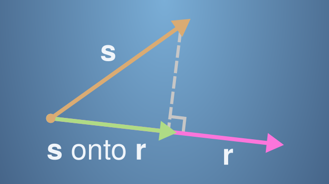

# **Vectors are objects that move around space**

## **Practice Quiz : Dot product of vectors**

### **Congratulations! You passed!**

#### **Grade received** 83.33%

#### **Latest Submission Grade** 83.33%

#### **To pass** 80% or higher

---

1. As we have seen in the lecture videos, the dot product of vectors has a lot of applications. Here, you will complete some exercises involving the dot product.

We have seen that the size of a vector with two components is calculated using Pythagoras' theorem, for example the following diagram shows how we calculate the size of the orange vector $$r=\begin{bmatrix}
    r_{1} \\
    r_{2}
    \end{bmatrix}$$

   - [x] AI controls the power grids for energy distribution, so all the power needed for industry and in daily life comes from AI.
   - [ ] AI helps to create a more efficient way of producing energy to power industries and personal devices.
   - [ ] AI is an essential ingredient in realizing tasks, in industry and in personal life.
    > ✖️ **Incorrect** No. There will always be areas in the world where AI is not a feasible option because of lack of infrastructures.

---

2. Which of the following play a major role to achieve a very high level of performance with Deep Learning algorithms?

    - [ ] Better designed features to use.
    - [ ] Large models.
    - [ ] Smaller models.
    - [x] Large amounts of data.
    - [ ] Deep learning has resulted in significant improvements in important applications such as online advertising, speech recognition, and image recognition.
    > ✖️ **Incorrect**. You didn't select all the correct answers

---

3. Recall this diagram of iterating over different ML ideas. Which of the statements below are true? (Check all that apply.)

    - [ ] Better algorithms allow engineers to get more data and then produce better Deep Learning models.
    - [x] Improvements in the GPU/CPU hardware enable the discovery of better Deep Learning algorithms.
    - [ ] Larger amounts of data allow researchers to try more ideas and then produce better algorithms in less time.
    - [x] Better algorithms can speed up the iterative process by reducing the necessary computation time
    > ✔️ <spane style="color: green;">**Correct** Great, you got all the right answers.

---

4. Neural networks are good at figuring out functions relating an input $x$ to an output $y$ given enough examples. True/False?

    - [ ] False
    - [x] True
    > ✔️ **Correct** Exactly, with neural networks, we don't need to "design" features by ourselves. The neural network figures out the necessary relations given enough data.

---

5. Which one of these plots represents a ReLU activation function?

    - [ ] 
    - [ ] 
    - [x] 
    - [ ] 
    > ✔️ <spane style="color: green;">**Correct** This is the ReLU activation function, the most used in neural networks.

---

6. Which of the following are examples of unstructured data? Choose all that apply.

    - [x] Sound files for speech recognition
    - [x] Images for bird recognition
    - [ ] Information about elephants’ weight, height, age, and the number of offspring.
    - [x] Text describing size and number of pages of books
    > ✔️ <spane style="color: green;">**Correct** Great, you got all the right answers.

---

7. A demographic dataset with statistics on different cities' population, GDP per capita, and economic growth is an example of “unstructured” data because it contains data coming from different sources. True/False?

    - [ ] True
    - [x] False
    > ✔️ <spane style="color: green;">**Correct** A demographic dataset with statistics on different cities' population, GDP per capita, and economic growth is an example of “structured” data in contrast to image, audio or text datasets.

---

8. RNNs (Recurrent Neural Networks) are good for data with a temporal component. True/False?

    - [ ] False
    - [x] True
    > ✔️ <spane style="color: green;">**Correct** Yes, RNN are designed to work with sequences; the elements of a sequence can be sorted by a temporal component.

---

9. In this diagram which we hand-drew in the lecture, what do the horizontal axis (x-axis) and vertical axis (y-axis) represent?

    - [ ] x-axis is the input to the algorithm y-axis is outputs.
    - [x] x-axis is the amount of data y-axis (vertical axis) is the performance of the algorithm
    - [ ] x-axis is the performance of the algorithm y-axis (vertical axis) is the amount of data.
    - [ ] x-axis is the amount of data y-axis is the size of the model you train.
    > ✔️ <spane style="color: green;">**Correct**

---

10. Assuming the trends described in the previous question's figure are accurate (and hoping you got the axis labels right), which of the following are true? (Check all that apply.)

    - [ ] Decreasing the size of a neural network generally does not hurt an algorithm’s performance, and it may help significantly.
    - [ ] Decreasing the training set size generally does not hurt an algorithm’s performance, and it may help significantly.
    - [x] Increasing the training set size generally does not hurt an algorithm's performance, and it may help significantly
    - [x] Increasing the size of neural network generally does not hurt an algorithm's performance, and it may help significantly
    > ✔️ <spane style="color: green;">**Correct** Great, you got all the right answers.
