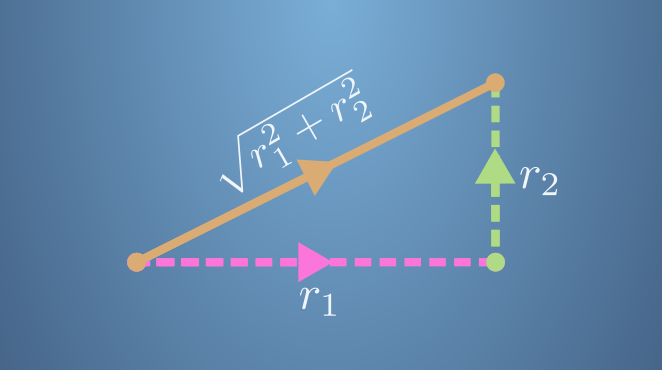
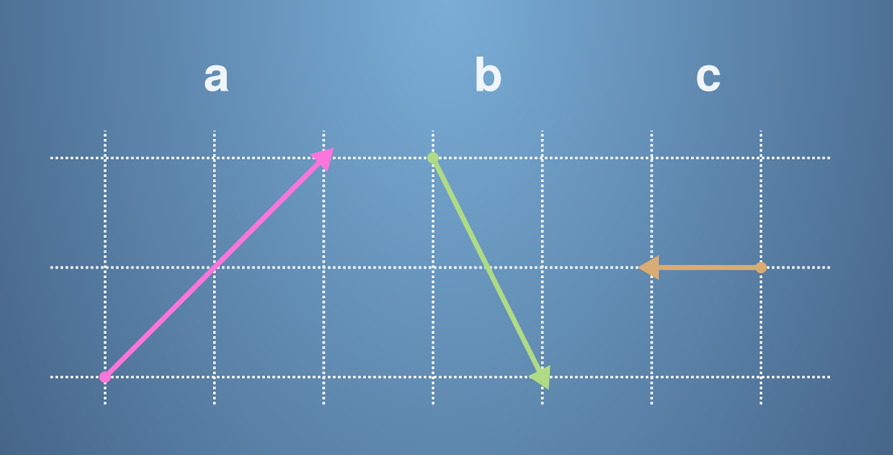

# **Vectors are objects that move around space**

- <details close><summary><h2>Practice Quiz 1 : Dot product of vectors</h2></summary>

    ### <span style="color: green;">**Congratulations! You passed!**</span>

    #### **Grade received** <span style="color: green;">83.33%</span>

    #### **Latest Submission Grade** 83.33%

    #### **To pass** 80% or higher

    ---

    1. As we have seen in the lecture videos, the dot product of vectors has a lot of applications. Here, you will complete some exercises involving the dot product.

        We have seen that the size of a vector with two components is calculated using Pythagoras' theorem, for example the following diagram shows how we calculate the size of the orange vector

        $$r=\begin{bmatrix}
            r_1 \\
            r_2 
        \end{bmatrix}$$

        

        In fact, this definition can be extended to any number of dimensions; the size of a vector is the square root of the sum of the squares of its components. Using this information, what is the size of the vector

        $$s=\begin{bmatrix}
            1\\
            3\\
            4\\
            2
        \end{bmatrix}$$

    - [ ] $|s| = 10$
    - [x] $|s| = \sqrt{30}$
    - [ ] $|s| = 30$
    - [ ] $|s| = \sqrt{10}$

        > ✔️ <spane style="color: green;">**Correct**</br>The size of the vector is the square root of the sum of the squares of the components.</span>

    ---

    2. Remember the definition of the dot product from the videos. For two $n$ component vectors, $a.b=a_1b_1+a_2b_2+\cdots+a_nb_n$.

        What is the dot product of the vector $r$ and $s$?

        $$r=\begin{bmatrix}
            -5\\
            3\\
            2\\
            8
        \end{bmatrix}, \quad s=\begin{bmatrix}
            1\\
            2\\
            -1\\
            0
        \end{bmatrix}$$

        - [ ] 
        $r.s=\begin{bmatrix}
            -4\\
            5\\
            1\\
            9
        \end{bmatrix}$
        - [ ] $r.s=1$
        - [x] $r.s=-1$
        - [ ] 
        $r.s=\begin{bmatrix}
            -5\\
            6\\
            -2\\
            0
        \end{bmatrix}$

        > ✔️ <spane style="color: green;">**Correct**</br>The dot product of two vectors is the total of the component-wise products.</span>

    ---

    3. The lectures introduced the idea of projecting one vector onto another. The following diagram shows the projection of $s$ onto $r$ when the vectors are in two dimensions:

        

        Remember that the scalar projection is the size of the green vector. If the angle between $s$ and $r$ is greater than $\pi/2$, the projection will also have a minus sign.

        We can do projection in any number of dimensions. Consider two vectors with three components, $r$ and $s$.

        $$r=\begin{bmatrix}
            3\\
            -4\\
            8
        \end{bmatrix}, \quad s=\begin{bmatrix}
            10\\
            5\\
            -6
        \end{bmatrix}$$

        What is the scalar projection of $s$ onto $r$?

        - [ ] $\frac{1}{2}$
        - [ ] $2$
        - [ ] $-\frac{1}{2}$
        - [x] $-2$

        > ✖️ <span style="color: red;">**Incorrect**</br>Check the lectures to remind yourself how to calculate the scalar projection, or see if you can work it out using the diagram.</span>

    ---

    4. Remember that in the projection diagram, the vector projection is the green vector:

        

        $$Let~~r=\begin{bmatrix}
                3\\
                -4\\
                0
            \end{bmatrix}, \quad and~~let~~s=\begin{bmatrix}
                10\\
                5\\
                -6
            \end{bmatrix}$$

        What is the vector projection of $s$ onto $r$?

        - [ ] 
        $\begin{bmatrix}
            6\\
            8\\
            0
        \end{bmatrix}$
        - [x] 
        $\begin{bmatrix}
            6/5\\
            -8/5\\
            0
        \end{bmatrix}$
        - [ ] 
        $\begin{bmatrix}
            6\\
            4\\
            0
        \end{bmatrix}$
        - [ ] 
        $\begin{bmatrix}
            30\\
            -20\\
            0
        \end{bmatrix}$

        > ✔️ <span style="color: green;">**Correct**</br>The vector projection of $s$ onto $r$ can be calculated with the formula $\frac{s.r}{r.r}r$.</span>

    ---

    5. $$Let~~r=\begin{bmatrix}
            3\\
            0\\
            4
        \end{bmatrix}, \quad and~~let~~s=\begin{bmatrix}
            0\\
            5\\
            12
        \end{bmatrix}$$

        Which is larger, $|a+b|$ or $|a|+|b|$?

        - [x] $|a+b| < |a| + |b|$
        - [ ] $|a+b| = |a| + |b|$
        - [ ] $|a+b| > |a| + |b|$

        > ✔️ <spane style="color: green;">**Correct**</br>In fact, it has been shown that $∣a+b∣\leq∣a∣+∣b∣$ for every pair of vectors $a$ and $b$. This is called the triangle inequality; try to think about it in the 2d case and see if you can understand why.</span>

    ---

    6. Which of the following statements about dot products are correct?

        - [ ] The order of vectors in the dot product is important, so that $s.r \neq r.s$.
        - [ ] The scalar projection of $s$ onto $r$ is always the same as the scalar projection of $r$ onto $s$.
        - [x] The vector projection of $s$ onto $r$ is equal to the scalar projection of $s$ onto $r$ multiplied by a vector of unit length that points in the same direction as $r$.
            > ✔️ <spane style="color: green;">**Correct**</br>The vector projection is equal to the scalar projection multiplied by $\frac{r}{|r|}$.</span>
        - [x] The size of a vector is equal to the square root of the dot product of the vector with itself.
            > ✔️ <spane style="color: green;">**Correct**</br>We saw in the video lectures that $|r| = \sqrt{r.r}$.</span>
        - [x] We can find the angle between two vectors using the dot product.
            > ✔️ <spane style="color: green;">**Correct**</br>We saw in the video lectures that $r.s = |r||s|cos\theta$, where $\theta$ is the angle between the vectors. This can then be used to find $\theta$.</span>

</details>

---

- <details close><summary><h2>Practice Quiz 2 : Changing basis</h2></summary>

    ### <span style="color: green;">**Congratulations! You passed!**</span>

    #### **Grade received** <span style="color: green;">100%</span>

    #### **Latest Submission Grade** 100%

    #### **To pass** 80% or higher

    ---

    1. In this quiz, you will practice changing from the standard basis to a basis consisting of orthogonal vectors.
    
        Given vectors $v, b_1, b_2$ all written in the standard basis, what is $v$ in the basis defined by $b_1$ and $b_2$? You are given that $b_1$ and $b_2$ are orthogonal to each other.

        $$v=\begin{bmatrix}
            5 \\
            -1 
        \end{bmatrix},\quad b_1=\begin{bmatrix}
            1 \\
            1
        \end{bmatrix},\quad b_2=\begin{bmatrix}
            1 \\
            -1
        \end{bmatrix}$$

       - [ ] 
       $v_b = \begin{bmatrix}
        -3 \\
        2
       \end{bmatrix}$
       - [ ] 
       $v_b = \begin{bmatrix}
        3 \\
        2
       \end{bmatrix}$
       - [ ] 
       $v_b = \begin{bmatrix}
        3 \\
        -2
       \end{bmatrix}$
       - [x] 
       $v_b = \begin{bmatrix}
        2 \\
        3
       \end{bmatrix}$

        > ✔️ <spane style="color: green;">**Correct**</br>The vector $v$ is projected onto the two vectors $b_1$ and $b_2$.</span>

    ---

    2. Given vectors 

        $$v=\begin{bmatrix}
            10 \\
            -5
        \end{bmatrix},\quad b_1=\begin{bmatrix}
            3 \\
            4
        \end{bmatrix},\quad b_2=\begin{bmatrix}
            4 \\
            -3
        \end{bmatrix}$$

        all written in the standard basis, what is $v$ in the basis defined by $b_1$ and $b_2$? You are given that $b_1$ and $b_2$ are orthogonal to each other.

        - [ ] 
        $v_b = \begin{bmatrix}
        11/5 \\
        2/5
       \end{bmatrix}$
       - [ ] 
       $v_b = \begin{bmatrix}
        -2/5 \\
        11/5
       \end{bmatrix}$
       - [ ] 
       $v_b = \begin{bmatrix}
        2/5 \\
        11/5
       \end{bmatrix}$
       - [x] 
       $v_b = \begin{bmatrix}
        2 \\
        11
       \end{bmatrix}$

        > ✔️ <spane style="color: green;">**Correct**</br>The vector $v$ is projected onto the two vectors $b_1$ and $b_2$.</span>

    ---

    3. Given vectors 

        $$v=\begin{bmatrix}
            2 \\
            2
        \end{bmatrix},\quad b_1=\begin{bmatrix}
            -3 \\
            1
        \end{bmatrix},\quad b_2=\begin{bmatrix}
            1 \\
            3
        \end{bmatrix}$$

        all written in the standard basis, what is $v$ in the basis defined by $b_1$ and $b_2$? You are given that $b_1$ and $b_2$ are orthogonal to each other.

        - [ ] 
        $v_b = \begin{bmatrix}
        -2/5 \\
        5/4
       \end{bmatrix}$
       - [ ] 
       $v_b = \begin{bmatrix}
        -2/5 \\
        4/5
       \end{bmatrix}$
       - [ ] 
       $v_b = \begin{bmatrix}
        5/4 \\
        -5/2
       \end{bmatrix}$
       - [x] 
       $v_b = \begin{bmatrix}
        2/5 \\
        -4/5
       \end{bmatrix}$

        > ✔️ <spane style="color: green;">**Correct**</br>The vector $v$ is projected onto the two vectors $b_1$ and $b_2$.</span>

    ---

    4. Given vectors 

        $$v=\begin{bmatrix}
            1 \\
            1 \\
            1
        \end{bmatrix},\quad b_1=\begin{bmatrix}
            2 \\
            1 \\
            0
        \end{bmatrix},\quad b_2=\begin{bmatrix}
            1 \\
            -2 \\
            -1
        \end{bmatrix},\quad b_3=\begin{bmatrix}
            -1 \\
            2 \\
            -5
        \end{bmatrix}$$

        all written in the standard basis, what is $v$ in the basis defined by $b_1, b_2$ and $b_3$? You are given that $b_1, b_2$ and $b_3$ are orthogonal to each other.

        - [ ] 
        $v_b = \begin{bmatrix}
        3 \\
        -1 \\
        -2
       \end{bmatrix}$
       - [ ] 
       $v_b = \begin{bmatrix}
        -3/5 \\
        -1/3 \\
        -2/15
       \end{bmatrix}$
       - [ ] 
       $v_b = \begin{bmatrix}
        -3/5 \\
        -1/3 \\
        2/15
       \end{bmatrix}$
       - [x] 
       $v_b = \begin{bmatrix}
        3/5 \\
        -1/3 \\
        -2/15
       \end{bmatrix}$

        > ✔️ <spane style="color: green;">**Correct**</br>The vector $v$ is projected onto the two vectors $b_1, b_2$ and $b_3$.</span>

    ---

    5. Given vectors 

        $$v=\begin{bmatrix}
            1 \\
            1 \\
            2 \\
            3
        \end{bmatrix},\quad b_1=\begin{bmatrix}
            1 \\
            0 \\
            0 \\
            0
        \end{bmatrix},\quad b_2=\begin{bmatrix}
            0 \\
            2 \\
            -1 \\
            0
        \end{bmatrix},\quad b_3=\begin{bmatrix}
            0 \\
            1 \\
            2 \\
            0
        \end{bmatrix},\quad b_4=\begin{bmatrix}
            0 \\
            0 \\
            0 \\
            3
        \end{bmatrix}$$

        all written in the standard basis, what is $v$ in the basis defined by $b_1, b_2, b_3$ and $b_4$? You are given that $b_1, b_2, b_3$ and $b_4$ are orthogonal to each other.

        - [ ] 
        $v_b = \begin{bmatrix}
        0 \\
        1 \\
        1 \\
        1
       \end{bmatrix}$
       - [ ] 
       $v_b = \begin{bmatrix}
        1 \\
        0 \\
        1 \\
        1
       \end{bmatrix}$
       - [ ] 
       $v_b = \begin{bmatrix}
        1 \\
        1 \\
        0 \\
        1
       \end{bmatrix}$
       - [x] 
       $v_b = \begin{bmatrix}
        1 \\
        1 \\
        1 \\
        0
       \end{bmatrix}$

        > ✔️ <spane style="color: green;">**Correct**</br>The vector $v$ is projected onto the two vectors $b_1, b_2, b_3$ and $b_4$.</span>

</details>

---

- <details close><summary><h2>Practice Quiz 3 : Linear dependency of a set of vectors</h2></summary>

    ### <span style="color: green;">**Congratulations! You passed!**</span>

    #### **Grade received** <span style="color: green;">83.33%</span>

    #### **Latest Submission Grade** 83.33%

    #### **To pass** 80% or higher

    ---

    1. In the lecture videos you saw that vectors are linearly dependent if it is possible to write one vector as a linear combination of the others. For example, the vectors $a, b$ and $c$ are linearly dependent if $a=q_1b+q_2c$ where $q_1$ and $q_2$ are scalars.

        Are the following vectors linearly dependent?

        $$a=\begin{bmatrix}
            1 \\
            1
        \end{bmatrix},\quad and~~b=\begin{bmatrix}
            2 \\
            2
        \end{bmatrix}$$

       - [x] Yes
       - [ ] No

        > ✔️ <spane style="color: green;">**Correct**</br>When there are two vectors we only need to check if one can be written as a scalar multiple of the other. We can see that the vectors are linearly dependent because $a=\frac{1}{2}b$</span>

    ---

    2. We say that two vectors are linearly independent if they are not linearly dependent, that is, we cannot write one of the vectors as a linear combination of the others. Be careful not to mix the two definitions up!

        Are the following vectors linearly independent?

        $$a=\begin{bmatrix}
            1 \\
            1
        \end{bmatrix},\quad and~~b=\begin{bmatrix}
            2 \\
            1
        \end{bmatrix}$$

       - [x] Yes
       - [ ] No

        > ✔️ <spane style="color: green;">**Correct**</br>These vectors are linearly independent as one is not a scalar multiple of the other.</span>

    ---

    3. We also saw in the lectures that three vectors that lie in the same two dimensional plane must be linearly dependent. This tells us that $a, b$ and $c$ are linearly dependent in the following diagram:

        

        What are the values of $q_1$ and $q_2$ that allow us to write $a = q_1b+q_2c$? Put your answer in the following codeblock:

        ```python
        # Assign the correct values for q1 and q2 to write a as a linear combination of b and c
        q1 = -1
        q2 = -3
        ```

        > ✔️ <spane style="color: green;">**Correct**</br>Good job!</span>

    ---

    4. In fact, an $n$-dimensional space can have as many as $n$ linearly independent vectors. The following three vectors are three dimensional, which means that we must check if they are linearly dependent or independent.

        Are the following vectors linearly independent?

        $$a=\begin{bmatrix}
            1 \\
            0 \\
            0
        \end{bmatrix},\quad b=\begin{bmatrix}
            1 \\
            1 \\
            0
        \end{bmatrix},\quad and~~c=\begin{bmatrix}
            1 \\
            0 \\
            1
        \end{bmatrix}$$

       - [x] Yes
       - [ ] No

        > ✔️ <spane style="color: green;">**Correct**</br>These vectors are linearly independent as one can not be written as a linear sum of the other two.</span>

    ---

    5. Are the following vectors linearly independent?

        $$a=\begin{bmatrix}
            1 \\
            0 \\
            1
        \end{bmatrix},\quad b=\begin{bmatrix}
            2 \\
            -1 \\
            1
        \end{bmatrix},\quad and~~c=\begin{bmatrix}
            -3 \\
            1 \\
            -2
        \end{bmatrix}$$

       - [ ] Yes
       - [x] No

        > ✔️ <spane style="color: green;">**Correct**</br>We can that one of the vectors can be written as a linear sum of the other two, $a=-b-c$</span>

    ---

    6. The following set of vectors cannot be used as a basis for a three dimensional space. Why?

        $$a=\begin{bmatrix}
            1 \\
            2 \\
            0
        \end{bmatrix},\quad b=\begin{bmatrix}
            -2 \\
            1 \\
            3
        \end{bmatrix},\quad and~~c=\begin{bmatrix}
            4 \\
            3 \\
            -3
        \end{bmatrix}$$

        - [ ] The vectors are linearly independent.
        - [x] The vectors are not linearly independent.
            > ✔️ <spane style="color: green;">**Correct**</br>We can see that $c = 2a - b$, so the vectors are linearly dependent. The definition of a basis requires that the vectors are linearly independent.</span>
        - [ ] The vectors do not span three dimensional space.
        - [ ] There are too many vectors for a three dimensional basis.
        
        > ✖️ <span style="color: red;">**Incorrect**</br>You didn't select all the correct answers.</span>

</details>

---

## Graded Quiz : Vector operations assessment

### <span style="color: green;">**Congratulations! You passed!**</span>

#### **Grade received** <span style="color: green;">100%</span>

#### **Latest Submission Grade** 100%

#### **To pass** 80% or higher

---

1. In this assessment, you will be tested on all of the different topics you have in covered this module. Good luck!

    A ship travels with velocity given by 
    $\begin{bmatrix}
        1 \\
        2
    \end{bmatrix}$
    , with current flowing in the direction given by 
    $\begin{bmatrix}
        1 \\
        1
    \end{bmatrix}$
    with respect to some co-ordinate axes.

    What is the velocity of the ship in the direction of the current?

    - [ ] 
    $\begin{bmatrix}
        2/3 \\
        2/3
    \end{bmatrix}$
    - [x] 
    $\begin{bmatrix}
        3/2 \\
        3/2
    \end{bmatrix}$
    - [ ] 
    $\begin{bmatrix}
        2/3 \\
        3/2
    \end{bmatrix}$
    - [ ] 
    $\begin{bmatrix}
        3/2 \\
        2/3
    \end{bmatrix}$

    > ✔️ <spane style="color: green;">**Correct**</br>This is the vector projection of the velocity of the ship onto the velocity of the current.</span>

---

2. A ball travels with velocity given by 
$\begin{bmatrix}
    2 \\
    1
\end{bmatrix}$
with wind blowing in the direction given by 
$\begin{bmatrix}
    3 \\
    -4
\end{bmatrix}$
with respect to some co-ordinate axes.

    What is the size of the velocity of the ball in the direction of the wind?

    - [ ] $\frac{5}{2}$
    - [x] $\frac{2}{5}$
    - [ ] $-\frac{2}{5}$
    - [ ] $-\frac{5}{2}$

    > ✔️ <spane style="color: green;">**Correct**</br>This is the scalar projection of the velocity of the ball onto the velocity of the wind.</span>

---

3. Given vectors 
$v=\begin{bmatrix}
    -4 \\
    -3 \\
    8
\end{bmatrix}$,
$b_1=\begin{bmatrix}
    1 \\
    2 \\
    3
\end{bmatrix}$,
$b_2=\begin{bmatrix}
    -2 \\
    1 \\
    0
\end{bmatrix}$, and
$b_3=\begin{bmatrix}
    -3 \\
    -6 \\
    5
\end{bmatrix}$ all written in the standard basis, what is $v$ in the basis defined by $b_1, b_2$ and $b_3$? You are given that $b_1, b_2$ and $b_3$ are all pairwise orthogonal to each other.

    - [x] $\begin{bmatrix}
        1 \\
        1 \\
        1
    \end{bmatrix}$
    - [ ] $\begin{bmatrix}
        0 \\
        1 \\
        1
    \end{bmatrix}$
    - [ ] $\begin{bmatrix}
        1 \\
        0 \\
        1
    \end{bmatrix}$
    - [ ] $\begin{bmatrix}
        1 \\
        1 \\
        0
    \end{bmatrix}$

    > ✔️ <spane style="color: green;">**Correct**</br>This is a change of basis in 3 dimensions.</span>

---

4. Are the following vectors linearly independent?

    $$a=\begin{bmatrix}
        1 \\
        2 \\
        -1
    \end{bmatrix},\quad b=\begin{bmatrix}
        3 \\
        -4 \\
        5
    \end{bmatrix},\quad and~~c=\begin{bmatrix}
        1 \\
        -8 \\
        7
    \end{bmatrix}$$

    - [ ] Yes
    - [x] No

    > ✔️ <spane style="color: green;">**Correct**</br>One can be written as a linear combination of the other two.</span>

---

5. At 12:00 pm, a spaceship is at position $\begin{bmatrix}
    3 \\
    2 \\
    4
\end{bmatrix} km$ away from the origin with respect to some 3 dimensional co ordinate system. The ship is travelling with velocity $\begin{bmatrix}
    -1 \\
    2 \\
    -3
\end{bmatrix} \frac{km}{s}$ What is the location of the spaceship after 2 hours have passed?

    - [ ] $\begin{bmatrix}
        2 \\
        4 \\
        1
    \end{bmatrix}$
    - [x] $\begin{bmatrix}
        1 \\
        6 \\
        -2
    \end{bmatrix}$
    - [ ] $\begin{bmatrix}
        -2 \\
        4 \\
        -1
    \end{bmatrix}$
    - [ ] $\begin{bmatrix}
        -1 \\
        -6 \\
        2
    \end{bmatrix}$

    > ✔️ <spane style="color: green;">**Correct**</br>This takes the idea of vectors in the context of a moving body.</span>
