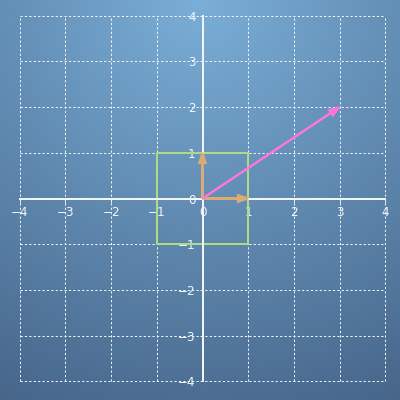
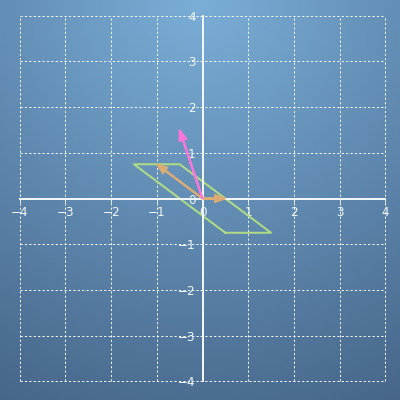
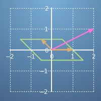
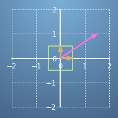
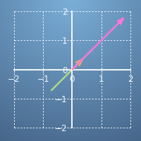
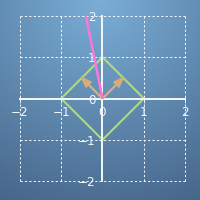
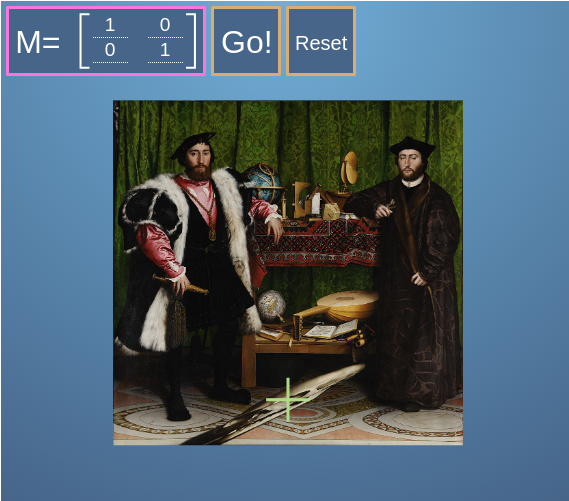

# **Matrices in Linear Algebra: Objects that operate on Vectors**

- <details close><summary><h2>Practice Quiz 1 : Using matrices to make transformations</h2></summary>

    ### <span style="color: green;">**Congratulations! You passed!**</span>

    #### **Grade received** <span style="color: green;">100%</span>

    #### **Latest Submission Grade** 100%

    #### **To pass** 80% or higher

    ---

    1. Matrices make transformations on vectors, potentially changing their magnitude and direction.

        If we have two unit vectors (in orange) and another vector, 
        $\begin{bmatrix}
            3 \\
            2
        \end{bmatrix}$
        (in pink), before any transformations - these look like this:

        

        Take the matrix,
        $A = \begin{bmatrix}
            1/2 & -1 \\
            0 & 3/4
        \end{bmatrix}$
        , see how it transforms the unit vectors and the vector $r$,

        

        What new vector $r^{'}$, does $A$ transform $r$ to? Specially, what does the following equal?

        $$Ar=\begin{bmatrix}
            1/2 & -1 \\
            0 & 3/4
        \end{bmatrix}\begin{bmatrix}
            3 \\
            2
        \end{bmatrix} =$$

    - [x] 
    $\begin{bmatrix}
        -1/2 \\
        3/2
    \end{bmatrix}$
    - [ ] 
    $\begin{bmatrix}
        -3/2 \\
        3/2
    \end{bmatrix}$
    - [ ] 
    $\begin{bmatrix}
        3/2 \\
        -1/2
    \end{bmatrix}$
    - [ ] 
    $\begin{bmatrix}
        3/2 \\
        -3/4
    \end{bmatrix}$

        > ✔️ <spane style="color: green;">**Correct**</br>You could either calculate this or read it off the graph.</span>

    ---

    2. Let's use the same matrix
    $A = \begin{bmatrix}
        1/2 & -1 \\
        0 & 3/4
    \end{bmatrix}$
    from the previous question.

        Type an expression for the vector
        $s = A\begin{bmatrix}
            -2 \\
            4
        \end{bmatrix}$

        ```python
        s = [-5, 3]
        ```

        > ✔️ <spane style="color: green;">**Correct**</br>Well done</span>

    ---

    3. Select the transformation which best corresponds to the matrix
    $M = \begin{bmatrix}
        -1/2 & 1/2 \\
        1/2 & 1/2
    \end{bmatrix}$

        - [ ] 
        - [ ] 
        - [ ] 
        - [x] 

        > ✔️ <span style="color: green;">**Correct**</br>The axes have been rotated, and also flipped here.</span>

    ---

    4. A digital image can be stored by putting lots of coloured pixels at their particular coordinates on a grid.

        If we apply a matrix transformation to the coordinates of each of the pixels in an image, we transform the image as a whole.

        Given a starting image (such as this one of “The Ambassadors” [1533] by Hans Holbein the Younger),

        

        which is made up of 400×400 pixels, if we apply the same transformation to each of those 160,000 pixels, the transformed image becomes:

        

        Pick a matrix that could correspond to the transformation.

        - [ ] 
        $\begin{bmatrix}
            \sqrt{3}/2 & \sqrt{3}/2 \\
            1/2 & 1/2
        \end{bmatrix}$
        - [ ] 
        $\begin{bmatrix}
            1/2 ^ 0 \\
            -\sqrt{3}/2 & 1/2
        \end{bmatrix}$
        - [x] 
        $\begin{bmatrix}
            \sqrt{3}/2 & -1/2 \\
            1/2 & \sqrt{3}/2
        \end{bmatrix}$
        - [ ] 
        $\begin{bmatrix}
            1/2 & 0 \\
            0 & \sqrt{3}/2
        \end{bmatrix}$

        > ✔️ <span style="color: green;">**Correct**</br>This is a rotation matrix (by 30° anticlockwise).</span>

    ---

    5. At the bottom of the “The Ambassadors”, in the middle of the floor, there is a skull that Holbein has already applied a matrix transformation to!

        To undo the transformation, build a matrix which is firstly a shear in the y direction followed by a scaling in y direction. I.e., multiply the matrices,

        $$M = \begin{bmatrix}
            1 & 0 \\
            0 & 8
        \end{bmatrix}\begin{bmatrix}
            1 & 0 \\
            -1/2 & 1
        \end{bmatrix}
        $$

        ```python
        M = [[1, 0],
             [-4, 8]]
        ```

        > ✔️ <spane style="color: green;">**Correct**</br>Well done.</br>Use your answer in the next question to transform the skull back.</span>

    ---

    6. Use your answer from the previous question to transform the skull back to normal. Change the values of the matrix and press Go! to score on this question.

        You can also use this example to experiment with other matrix transformations. Try some of the ones in this quiz. Have a play!

        

        > ✔️ <spane style="color: green;">**Correct**</br>Feel free to use the tool to try out different matrices too.</span>

</details>

---

- <details close><summary><h2>Practice Quiz 2 : Solving linear equations using the inverse matrix</h2></summary>

    ### <span style="color: green;">**Congratulations! You passed!**</span>

    #### **Grade received** <span style="color: green;">100%</span>

    #### **Latest Submission Grade** 100%

    #### **To pass** 80% or higher

    ---

    1. You go to the shops on Monday and buy 1 apple, 1 banana, and 1 carrot; the whole transaction totals €15. On Tuesday you buy 3 apples, 2 bananas, 1 carrot, all for €28. Then on Wednesday 2 apples, 1 banana, 2 carrots, for €23.

        Construct a matrix and vector for this linear algebra system. That is, for

        $$A\begin{bmatrix}
            a \\
            b \\
            c 
        \end{bmatrix}=\begin{bmatrix}
            s_{Mon} \\
            s_{Tue} \\
            s_{Wed}
        \end{bmatrix}$$

        Where $a, b, c$ are the prices of apples, bananas, and carrots. And each $s$ is the total for that day.

        Fill in the components of $A$ and $s$.

       ```python
       # Replace A and s with the correct values below:
        A = [[1, 1, 1],
             [3, 2, 1],
             [2, 1, 2]]

        s = [15, 28, 23]
        ```

        > ✔️ <spane style="color: green;">**Correct**</br>Correct! Well done.</span>

    ---

    2. Given another system, $Br = t$,

        $$
        \begin{array}{c}
            ①: \\
            ②: \\
            ③:
        \end{array}\begin{bmatrix}
            4 & 6 & 2 \\
            3 & 4 & 1 \\
            2 & 8 & 13
        \end{bmatrix}\begin{bmatrix}
            a \\
            b \\
            c
        \end{bmatrix} = \begin{bmatrix}
            9 \\
            7 \\
            2
        \end{bmatrix}
        $$

        We wish to convert this to echelon form, by using elimination. Starting with the first row, ①, if we divide the whole row by 4, then the top-left element of the matrix becomes 1,

        $$
        \begin{array}{c}
            ①^{'}: \\
            ②^{'}: \\
            ③^{'}:
        \end{array}\begin{bmatrix}
            1 & 3/2 & 1/2 \\
            3 & 4 & 1 \\
            2 & 8 & 13
        \end{bmatrix}\begin{bmatrix}
            a \\
            b \\
            c
        \end{bmatrix} = \begin{bmatrix}
            9/4 \\
            7 \\
            2
        \end{bmatrix}
        $$

        Next, we need to fix the second row. This results in the following:

        $$
        \begin{array}{c}
            ①^{"}: \\
            ②^{"}: \\
            ③^{"}:
        \end{array}\begin{bmatrix}
            1 & 3/2 & 1/2 \\
            0 & 1 & 1 \\
            2 & 8 & 13
        \end{bmatrix}\begin{bmatrix}
            a \\
            b \\
            c
        \end{bmatrix} = \begin{bmatrix}
            9/4 \\
            -1/2 \\
            2
        \end{bmatrix}
        $$

        What steps did we take?

        - [ ] The new second row, $②^{"}$ is the old second row minus two times the old first row, i.e., $②^{"} = [②^{'} - 2①^{'}]$
        - [x] The new second row, $②^{"}$ is the old second row minus three times the old first row, then all multiplied by -2, i.e.,  $②^{"} = [②^{'} - 3①^{'}]\times (-2)$
        - [ ] The new second row, $②^{"}$ is the old second row divided by four minus the old first row, i.e., $②^{"} = ②^{'}/4 - ①^{'}$
        - [ ] The new second row, $②^{"}$ is the old second row minus three, i.e., $②^{"} = ②^{'} - 3$ 

        > ✔️ <spane style="color: green;">**Correct**</br>We've made the new second row a linear combination of previous rows.</span>

    ---

    3. From the previous question, our system is almost in echelon form. 

        $$
        \begin{array}{c}
            ①^{"}: \\
            ②^{"}: \\
            ③^{"}:
        \end{array}\begin{bmatrix}
            1 & 3/2 & 1/2 \\
            0 & 1 & 1 \\
            2 & 8 & 13
        \end{bmatrix}\begin{bmatrix}
            a \\
            b \\
            c
        \end{bmatrix} = \begin{bmatrix}
            9/4 \\
            -1/2 \\
            2
        \end{bmatrix}
        $$

        Fix row 3 to be a linear combination of the other two. What is the echelon form of the system?

        - [ ] 
        $\begin{bmatrix}
            1 & 0 & 0 \\
            0 & 1 & 0 \\
            0 & 0 & 1
        \end{bmatrix}\begin{bmatrix}
            a \\
            b \\
            c
        \end{bmatrix} = \begin{bmatrix}
            9/4 \\
            -1/2 \\
            -1/4
        \end{bmatrix}$
       - [ ] 
       $\begin{bmatrix}
            1 & 3/2 & 1/2 \\
            0 & 1 & 1 \\
            0 & 0 & 1
        \end{bmatrix}\begin{bmatrix}
            a \\
            b \\
            c
        \end{bmatrix} = \begin{bmatrix}
            9/4 \\
            -1/2 \\
            1/2
        \end{bmatrix}$
       - [x] 
       $\begin{bmatrix}
            1 & 3/2 & 1/2 \\
            0 & 1 & 1 \\
            0 & 0 & 1
        \end{bmatrix}\begin{bmatrix}
            a \\
            b \\
            c
        \end{bmatrix} = \begin{bmatrix}
            9/4 \\
            -1/2 \\
            0
        \end{bmatrix}$
       - [ ] 
       $\begin{bmatrix}
            1 & 3/2 & 1/2 \\
            0 & 1 & 1 \\
            0 & 5 & 1
        \end{bmatrix}\begin{bmatrix}
            a \\
            b \\
            c
        \end{bmatrix} = \begin{bmatrix}
            9/4 \\
            -1/2 \\
            -5/2
        \end{bmatrix}$

        > ✔️ <spane style="color: green;">**Correct**</br>This system is now in echelon form.</span>

    ---

    4. Taking your answer from the previous part, use back substitution to solve the system.

        What is the value of
        $\begin{bmatrix}
            a \\
            b \\
            c
        \end{bmatrix}$
        ?

        - [x] 
        $r = \begin{bmatrix}
        3 \\
        -1/2 \\
        0
       \end{bmatrix}$
       - [ ] 
       $r = \begin{bmatrix}
        9/4 \\
        -1/2 \\
        0
       \end{bmatrix}$
       - [ ] 
       $r = \begin{bmatrix}
        3/2 \\
        1/2 \\
        1
       \end{bmatrix}$
       - [ ] 
       $r = \begin{bmatrix}
        9 \\
        7 \\
        2
       \end{bmatrix}$

        > ✔️ <spane style="color: green;">**Correct**</br>Well done!</span>

    ---

    5. Let's return to the apples and bananas from Question 1.

        Take your answer to Question 1 and convert the system to echelon form. I.e., 

        $$\begin{bmatrix}
            1 & A^{'}_{12} & A^{'}_{13} \\
            0 & 1 & A^{'}_{23} \\
            0 & 0 & 1
        \end{bmatrix}\begin{bmatrix}
            a \\
            b \\
            c 
        \end{bmatrix} = \begin{bmatrix}
            s^{'}_{1} \\
            s^{'}_{2} \\
            s^{'}_{3}
        \end{bmatrix}$$

        Find values for $A^{'}$ and $s^{'}$.

        ```python
        # Replace A and s with the correct values below:
        A = [[1, 1, 1],
             [0, 1, 2],
             [0, 0, 1]]
        
        s = [15, 17, 5]
        ```

        > ✔️ <spane style="color: green;">**Correct**</br>Well done!</span>

    ---

    6. Following on from the previous question; now let's solve the system using back substitution.

        What is the price of apples, bananas, and carrots?

        ```python
        # Replace a, b, and c with the correct values below:
        s = [3, 7, 5]
        ```

        > ✔️ <spane style="color: green;">**Correct**</br>Well done!</span>

    ---

    7. If every week, you go to the shops and buy the same amount of apples, bananas, and oranges on Monday, Tuesday, and Wednesday; and every week you get a new list of daily totals - then you should solve the system in general.

        That is, find the inverse of the matrix you used in Question 1.

        ```python
        # Replace the matrix elements with the correct values below:
        Ainv = [[-1.5, 0.5, 0.5],
                [2, 0, -1],
                [0.5, -0.5, 0.5]]
        ```

        > ✔️ <spane style="color: green;">**Correct**</br>Well done!</span>

    ---

    8. In practice, for larger systems, one never solves a linear system by hand as there are software packages that can do this for you - such as *numpy* in Python.

        Use this code block to see *numpy* invert a matrix.

        You can try to invert any matrix you like. Try it out on your answers to the previous question.

        ```python
        import numpy as np

        A = [[1, 1, 1],
            [3, 2, 1],
            [2, 1, 2]]
        Ainv = np.linalg.inv(A)
        ```

        In general, one shouldn't calculate the inverse of a matrix unless absolutely necessary. It is more computationally efficient to solve the linear algebra system if that is all you need.

        Use this code block to solve the following linear system with *numpy*. $Ar = s$

        $$
        \begin{bmatrix}
            4 & 6 & 2 \\
            3 & 4 & 1 \\
            2 & 8 & 13
        \end{bmatrix}\begin{bmatrix}
            a \\
            b \\
            c
        \end{bmatrix} = \begin{bmatrix}
            9 \\
            7 \\
            2
        \end{bmatrix}
        $$

        ```python
        import numpy as np
        A = [[4, 6, 2],
            [3, 4, 1],
            [2, 8, 13]]

        s = [9, 7, 2]

        r = np.linalg.solve(A, s)
        ```

        > ✔️ <spane style="color: green;">**Correct**</br>In cases when you don't need the inverse matrix itself, linear algebra routines are quicker to solve the system for each case.</span>

</details>
