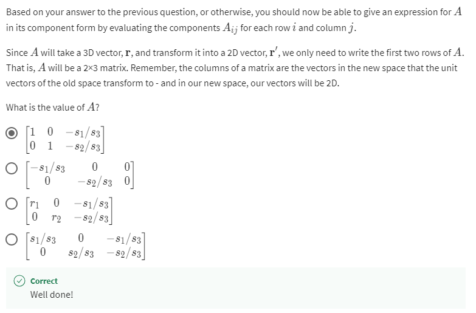

# **Matrices Makes Linear Mapping**

- 

<h2>Practice Quiz 1 : Non-square matrix multiplication</h2>

    ### **Congratulations! You passed!**

    #### **Grade received** 87.50%

    #### **Latest Submission Grade** 87.50%

    #### **To pass** 75% or higher

    ---

    1. 
    

    ---

    2.
    

    ---

    3.
    

    ---

    4. 
    

    ---

    5. 
    

    ---

    6. 
    

    ---

    7.
    

    ---

    8.
    

---

- 

<h2>Practice Quiz 2 : Using non-square matrices to do a projection</h2>

    ### **Congratulations! You passed!**

    #### **Grade received** 100%

    #### **Latest Submission Grade** 100%

    #### **To pass** 40% or higher

    ---

    1. 
    

    ---

    2. 
    

    ---

    3. 
    

    ---

    4. 
    

    ---

    5. 
    

    ---

    6. 
    

