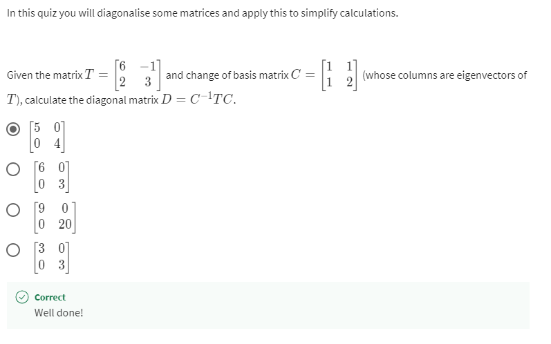

# **Eigenvalues and Eigenvectors: Application to Data Problems**

- 

<h2>Practice Quiz 1 : Selecting eigenvectors by inspection</h2>

    ### **Congratulations! You passed!**

    #### **Grade received** 100%

    #### **Latest Submission Grade** 100%

    #### **To pass** 80% or higher

    ---

    1. 
    
    

    ---

    2.
    
    

    ---

    3.
    
    

    ---

    4. 
    
    

    ---

    5. 
    
    

    ---

    6. 
    
    

---

- 

<h2>Practice Quiz 2 : Characteristic polynomials, eigenvalues and eigenvectors</h2>

    ### **Congratulations! You passed!**

    #### **Grade received** 90%

    #### **Latest Submission Grade** 90%

    #### **To pass** 80% or higher

    ---

    1. 
    

    ---

    2. 
    

    ---

    3. 
    

    ---

    4. 
    

    ---

    5. 
    

    ---

    6. 
    

    ---

    7. 
    

    ---

    8. 
    

    ---

    9. 
    

    ---

    10. 
    

---

- 

<h2>Practice Quiz 3 : Diagonalisation and applications</h2>

    ### **Congratulations! You passed!**

    #### **Grade received** 100%

    #### **Latest Submission Grade** 100%

    #### **To pass** 80% or higher

    ---

    1. 
    

    ---

    2. 
    

    ---

    3. 
    

    ---

    4. 
    

    ---

    5. 
    

    ---

    6. 
    

    ---

    7.
    

---

<h2>Quiz : Eigenvalues and eigenvectors</h2>

### **Congratulations! You passed!**

#### **Grade received** 90%

#### **Latest Submission Grade** 90%

#### **To pass** 80% or higher

---

1. 

---

2. 

---

3. 

---

4. 

---

5. 

---

6. 

---

7.

---

8. 

---

9. 

---

10.

---
